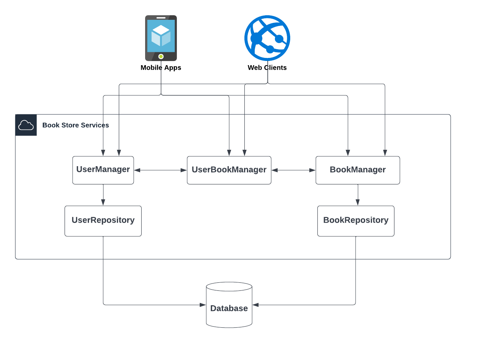
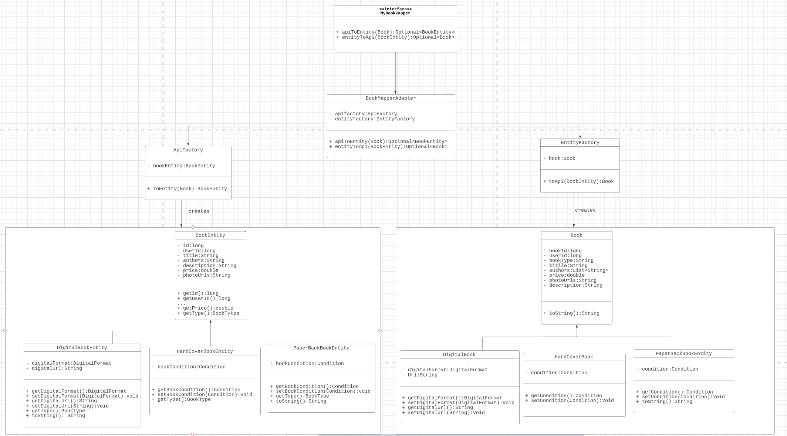

# **Course Project Report**

# Table of Contents
- [**Course Project Report**](#course-project-report)
- [Table of Contents](#table-of-contents)
- [Explanation of Software](#explanation-of-software)
  - [Overview](#overview)
  - [Implementation](#implementation)
- [Four Design Patterns](#four-design-patterns)
  - [Facade Pattern](#facade-pattern)
    - [Problem](#problem)
    - [Solution](#solution)
    - [Implementation](#implementation-1)
  - [Adapter Pattern](#adapter-pattern)
    - [Problem](#problem-1)
    - [Solution](#solution-1)
    - [Implementation](#implementation-2)
  - [Factory Pattern](#factory-pattern)
    - [Problem](#problem-2)
    - [Solution](#solution-2)
    - [Implementation](#implementation-3)
  - [Singleton Pattern](#singleton-pattern)
    - [Problem](#problem-3)
    - [Solution](#solution-3)
    - [Implementation](#implementation-4)
- [Contributions](#contributions)

# Explanation of Software
## Overview
We have used Java frameworks to develop a fully functioning web application for buying and selling used textbooks. Our application leverages a monolithic architecture but features REST endpoints, meaning that it can be transformed into a microservices application with minimal effort. Our application features:
- REST endpoints
- Rich documentation of REST endpoints following the OpenAPI specification
- A professional user interface (UI)
- Data persistence
- User login and authentication

The key technologies that we are using are:
- [Spring Boot](https://spring.io/projects/spring-boot)
- [Spring Data JPA](https://spring.io/projects/spring-data-jpa)
- [Spring Security](https://spring.io/projects/spring-security)
- [MySQL](https://www.mysql.com/)
- [JavaServer Faces](https://www.oracle.com/java/technologies/javaserverfaces.html) (configured and integrated with the [AdminFaces](https://adminfaces.github.io/site/) template, which also provides a UI template)
- [OpenAPI](https://swagger.io/resources/open-api/)

These frameworks – in particular, the Spring* frameworks – incorporate a variety of design patterns in order to provide functionality for our application. Observing and working with these technologies has helped all of us to better understand real-world usage and good implementation of design patterns. Conversely, our knowledge of design patterns from this class helped us to better understand the functions and proper usage of each framework. In creating this application, we have all gained valuable experience using design patterns.

By leveraging these frameworks and, by extension, the good design patterns and practices used by them, we seek to create an extensible, reusable, and maintainable web application.

## Implementation
1. User Interface (UI) Layer
     - `/book-service/.../java/.../bean/*MB.java` classes: Leverage the Spring Boot and JSF frameworks to provide information and functionality to UI screens.
     - `/book-service/.../webapp/*.xhtml` files: Define UI screens using a combination of plain HTML and [PrimeFaces](https://www.primefaces.org/showcase/index.xhtml?jfwid=71d71) elements.
2. Database Persistence (DB) Layer
    - `/book-service/.../java/.../core/*` folders: Contain data persistence configuration for `book` and `user` entities. The structure and implementation of each package (book and user) are essentially identical.
    - `/book-service/java/.../core/.../model/*Entity.java` classes: Use JPA annotations to define database persistence entity classes. The `@Table("table_name")` annotation defines which DB table each entity reflects.
    - `/book-service/java/.../core/.../repository/*Repository.java` classes: Leverage the JPA framework to provide access to the information stored in the database. Basic CRUD operations are automatically implemented by extending the `JpaRepository` class. Additional functionality (ex. get users by username) is given by defining additional methods following specific JPA naming conventions (ex. `findByUsername(String username)`).
3. Application Programming Interface (API) Layer
   - `/api/.../core/book/models` and `/api/.../core/user/models` folders: Contain DTO objects responsible for carrying data between the UI and DB layers. `/book-service/java/.../core/mapper/*Mapper.java` classes are used to convert DTO objects to DB entities, and vice-versa.
   - `/api/.../core/book/services/BookService.java` and `/api/.../core/user/services/UserService.java` classes: Interfaces using Spring Boot annotations to define the REST endpoints of our application. Endpoints are defined using the `@*Mapping` annotations. Each endpoint is documented using the OpenAPI annotations (`@Operation`, `@ApiResponses`). These interfaces are implemented in the `/book-service/java/.../core/service/*ServiceImpl.java` classes.
   - `/book-service/java/.../core/manager/*.java` classes: Provide `*Repository.java` functionalities to `*ServiceImpl.java` implementations. They use the `/book-service/java/.../core/mapper/*Mapper.java` classes to convert DB entity data from repository classes to DTO objects used by the API and UI layers.

# Four Design Patterns
Here are four key design patterns that we have identified as essential to our application:

## Facade Pattern
### Problem
The Book Store service is divided into sub-systems to reduce complexities. For example, we have BookService to manage all the business logic of books and UserServices to manage users' business logic. Additionally, we have implemented the Spring JPA Data library to manage MySQL data and implement CRUD (Create, Read, Update and Delete) functionality. Further, there are dependencies between sub-systems. However, clients (frontend, mobile devices, etc.) interacting with those sub-system classes to fulfill business requirements can create a significant level of complexity.

The Book Store app is designed to allow users to sell their used textbook. To allow users to list their used books for sale, we use the following services:
  - **BookManager service**: Checks the bookstore database running on MySQL for the book's availability.
  - **UserManager service**: Manages the user's account information.
  - **UserBookManager service**: Manages the books listed for sale. Allows the seller to:
    - View textbook listings created by other users
    - List all of the textbooks that they want to sell
    - Delete their listing
  - **Spring MVC Controller**: A controller interacts with the preceding services to list books. When a user interacts with the UI to manage the textbooks that they want to sell, the request is mapped to the controllers, which is interacts with the services to fulfill the request and then respond with the correct information and status of the request.

This is a web-based application. As such, we plan to support mobile clients. So, users could download the app to their mobile device and use it to manage their books. The following diagram shows how different clients interact with the application's services and their complexity:

From the above diagram, we see that the frontend clients are tightly coupled with the systems' classes. Therefore, adding or updating some part of the services will impact the existing systems. For example, if we are adding a 'review' service to manage users’ reviews of other users, all of the interacting classes will need to update to adapt to the new service.

### Solution
We implement the facade pattern into the sub-systems. For example, we are creating a facade class, `UserService`. Clients can interact with this facade classes for user management instead of interacting with each individual sub-system service.

### Implementation

## Adapter Pattern
### Problem
 - On the UI, we want to display user information (ex. full name, email, etc.) alongside book information.
 - The book API entities used by the frontend beans contain only a user’s ID.
 - The JSF framework (used to display information on the UI) requires that we associate book and user information within the same class. It is not good style to do something like getUserFor(book) once the book has been passed along to the UI.

### Solution
 - We create an interface modeling the information expected by the UI (`BookListing.java`).
 - We use the Adapter pattern to make the Book API entity compatible  with this interface (`BookListingAdapter.java`).

### Implementation

## Factory Pattern
### Problem
  - In our application, there is more than one kind of book. We can have Hardcover, Paperback, and Digital books.
  - We model this in the API layer using:
      - One abstract class, `Book`
      - Three sub-classes of `Book`: `HardCoverBook`, `PaperBackBook`, and `DigitalBook`
  - We model this in the DB layer using:
      - One abstract class, `BookEntity`
      - Three sub-classes of `BookEntity`: `HardCoverBookEntity`, `PaperBackBookEntity`, and `DigitalBookEntity`
  - The `BookRepository` class returns objects of type `BookEntity`, but the API layer expects objects of type `Book`. The DB layer must convert all `BookEntity` objects to type `Book` before they can be received by API layer, and vice-versa.
   - But we will need to instantiate different sub-classes of the `Book` class depending on what sub-class of `BookEntity` we are converting, and vice-versa.

### Solution
  - Use the factory pattern to define `APIFactory` and `EntityFactory` classes who, when given a `Book` or `BookEntity` object, respectively, will instantiate and return the appropriate subclass for the given object.

### Implementation

## Singleton Pattern
### Problem
We use special Java classes called management beans to provide information to the UI screens and receive/store information coming from the UI screens. Management beans also give the UI screens access to application functionalities by allowing the UI to call any public method of a management bean. These beans are defined using the Spring framework's `@Component` annotation. The JSF framework makes these management beans accessible to the UI screens.

Additionally, we want some management beans (ex. the sell book screen) to user input information even if the user navigates away from that screen's management bean.

### Solution
We use the Spring Boot framework's `@SessionScope` annotation to define those management beans that should be persistent between views. But how does Spring Boot make this possible? It uses the singleton pattern that we have studied in class. In fact, every management bean is treated as a singleton, even those not marked with the `@SessionScope` annotation. However, if this annotation is not used on a management bean, Spring Boot with destroy that management bean's singleton instance upon each new request.

Because Spring Boot is a web application development framework, it uses multi-threading to ensure that management bean singletons can be safely accessed by many users concurrently. By studying the way that Spring Boot implements the singleton pattern, for the purpose of leveraging their implementation for ourselves, we have learned a lot about the singleton pattern, as it is used by professional developers.

### Implementation
This design pattern is implemented by the Spring Boot framework.

# Contributions
This project was made possible through the hard work and dedication of all 5 team members. Each team member provided a unique set of skills to the project, and not all contributions are reflected in the number of commits made to the codebase. Because not all team members were familiar with the Spring Boot framework, a lot of their contribution was made either later in project’s development (once they had time to learn about Spring Boot) or during the requirements/design phase of the project.

Here is what each group member contributed to the project:
- Bin Lao
  - Configured initial Spring Boot project
  - Created REST endpoints
  - Created documentation for REST endpoints using the OpenAPI Specification
  - Configured Spring Boot JPA + MySQL implementation
  - Configured database persistence for Book entities
  - Created UML diagram describing facade pattern implementation
  - Dockerized application
  - Wrote factory pattern section of project report
- Logan Fitzpatrick
  - Refactored backend code for consistency:
    - Re-wrote database persistence implementation for User entities
    - Created User DTO classes in `api` project
- Patrick Mollins
  - Created SQL script to generate data for testing the application
  - Planned, recorded, and edited presentation video
- Qihao Guo
  - Implemented mapping functionality for User API to database entity classes and vice-versa
  - Implemented factory pattern for creating instances of the abstract classes `Book` and `BookEntity`
  - Created UML diagram describing factory pattern implementation
- Casey O'Neill
  - Configured JSF framework integration (including Dockerization of components)
  - Configured Spring Security integration
  - Created user interface screens (implemented as `.xhtml` files)
  - Created management beans for each user interface screen (connecting frontend UI to backend persistence functionality)
  - Configured initial database persistence implementation for User entities
  - Created UML diagram describing adapter pattern implementation
  - Created and edited project report
